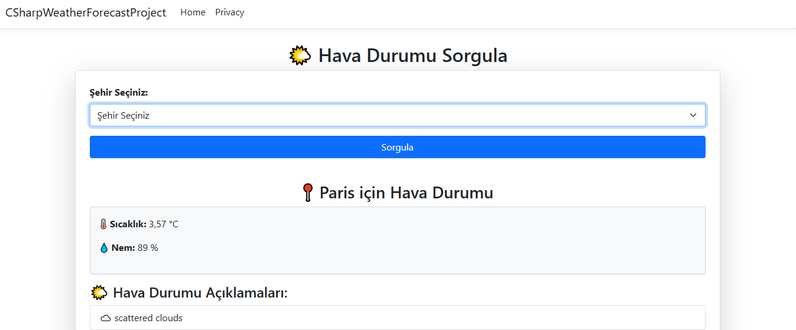

# Scenario:

Weather Forecast Data Fetching Application

## Scenario Description:

- The user is able to select a city to see its real-time weather forecast:

## Features:

- Models-Views-Controllers (MVC) design pattern
- Real-time weather forecast data fetching from the OpenWeatherMap API
- User-friendly interface
- User-friendly error handling
- Serialization and deserialization of JSON data

## Some views from the project:

